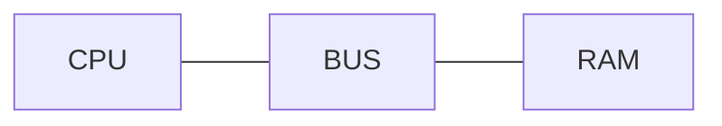
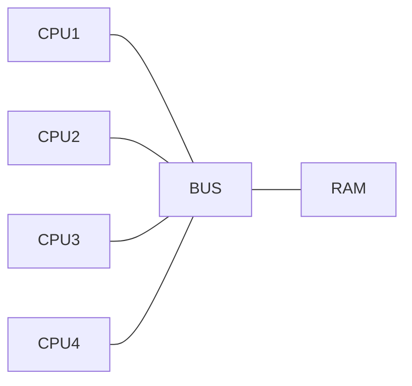

# Numa

## What is Numa

NUMA 的全名是Non-Uniform-Memory-Access(Architecture)。对于单核的CPU来说，CPU通过bus访问内存的速度完全取决于bus能够有多大的传输速度，一般来说这种架构下，CPU和内存之间的传输速度并不是一个问题。

但对于多核CPU来说，如果使用传统的这种方式连接，则在CPU访问内存的过程中会产生冲突和等待的问题，CPU越多，这个问题越严重。

所以NUMA的出现解决了这个问题，NUMA将不同的CPU绑定到不同的内存上，作为CPU的local RAM，而其他的内存则仍然对该CPU可见，作为CPU的remote RAM。在本地RAM不够用时，可以使用remote RAM，只不过效率要低上一些。而这样一个cpu+ram的组合，则在NUMA中被称为一个 numa node。在实际应用中，可能不是单个cpu使用单个ram，有可能是多个cpu使用某个ram或者某几个ram。

## 查看numa node

#### numactl

`numactl --hardware` 可以用来查看本机的numa node分配情况，可能需要进行安装

#### lstopo

`lstopo --of png`可以将系统的物理结构展示出来

## numa和虚拟机

一般来说，在进行虚拟机资源分配的时候，我们不希望同一台虚拟机使用的cpu资源和内存资源分布在不同的numa node上，这样会造成性能下降。所以在创建虚拟机的时候我们一般会将虚拟机与单个的numa node进行绑定，以达到虚拟机的最大性能。

vcpu：虚拟机的虚拟机cpu

pcpu：宿主机的物理cpu

host numa node：宿主机的numa node拓扑

guest numa node：虚拟机的numa node拓扑

在虚拟机需要较大资源，宿主机的单个numa node资源不够的情况下，我们就需要给虚拟机分配多个numa node的资源。在这种情况下，如果我们的虚拟机对宿主机的numa topo不可见的话，则依旧会产生同样的性能问题。所以在这种场景下，会将宿主机的numa topo暴露给虚拟机，虚拟机上同样创建numa node，将host numa node与 guest numa node进行绑定。这样一来，虚拟机依旧会保持着同一进程在同一个numa node上运行的原则。

